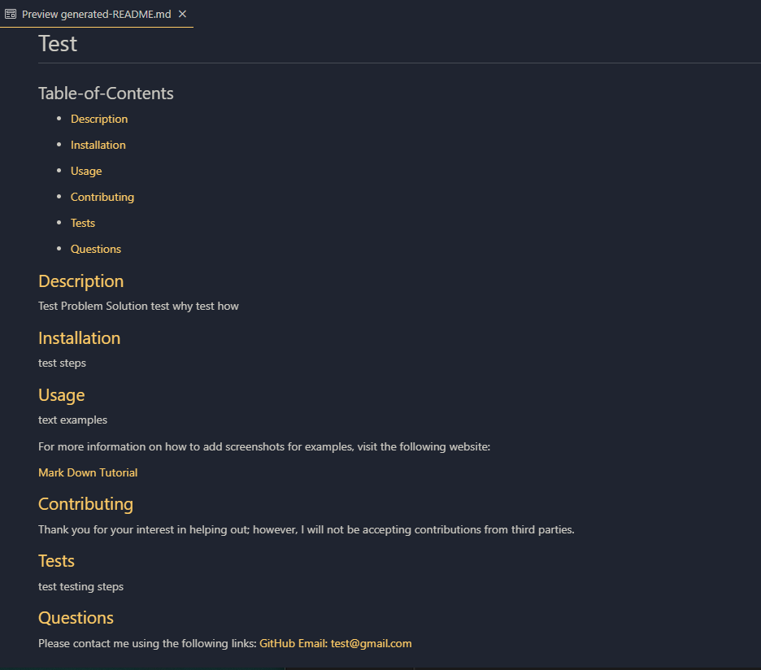

# Professional Read Me Generator

 ## Table-of-Contents

  * [User Story](#user-story)
  * [Description](#description)
  * [Walkthrough Video](#walkthrough-video)
  * [ScreenShot](#screenshots)

  
 # User-Story
 ```md
AS A developer
I WANT a README generator
SO THAT I can quickly create a professional README.
```
# Description
The project will help a user generate a README without having to worry about applying proper mark down syntax.


# Walkthrough-Video

[Walkthrough Video Link](https://drive.google.com/file/d/1ZRC4EsiyDaJLrQ7PuI2vyRxhxPfjWXLL/view)


# ScreenShots 




